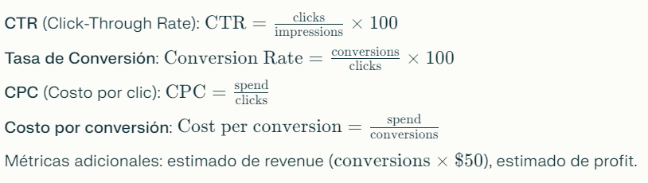
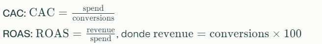
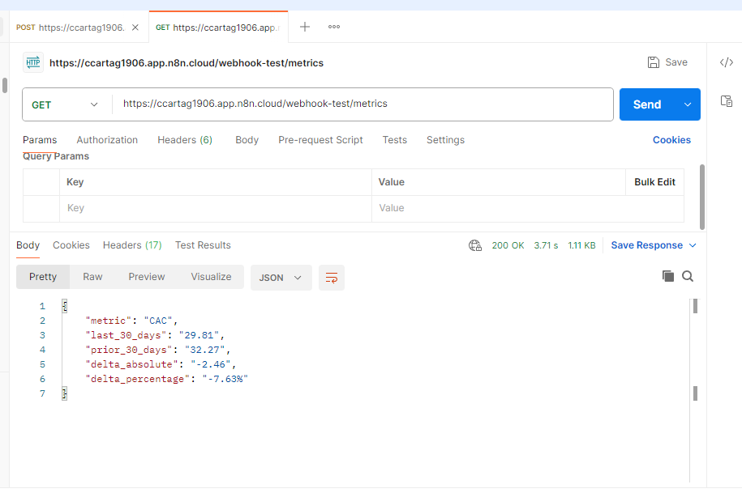

# Dev Test – AI Data Engineer Solution

This repository contains the solution for the AI Data Engineer position challenge. It includes a data ingestion workflow, KPI modeling in SQL, analyst access capabilities, and a demo agent for natural language queries.

## 1. Requirements

- Python 3.8+ (if using complementary scripts)
- JavaScript ES6 (ECMAScript 6 or higher)
- BigQuery (or your chosen warehouse)
- n8n (SQL/API workflow automation)

# Data Ingestion (ETL) with n8n

The ingestion process is fully automated through an n8n workflow, enabling the loading of the ads_spend.csv dataset, cleaning, transforming, and enriching the data before storing it in the warehouse (BigQuery/DuckDB).

## Workflow Description

- **Manual Trigger**

The flow starts when clicking "Execute workflow".

- **HTTP Request Node**

Downloads the CSV file using the public raw URL of ads_spend.csv on GitHub.

Configures the User-Agent header to avoid download restrictions.

- **Code Node (Custom JavaScript)**

Processes CSV content from plain text, converting each record into a structured JSON object enriched with calculated metrics.

Validates data structure and reports errors if the CSV is empty or corrupted.

Parses numeric fields and calculates key metrics for each record:



The complete code is included below for reference and can be reused/adapted directly in n8n.

```javascript
// PROCESS CSV from JSON - N8N VERSION 
console.log('=== STARTING PROCESSING ===');

// Verify items structure
if (!items || items.length === 0) {
  console.log('ERROR: No items available');
  return [{ json: { error: 'No data available' } }];
}

// Find CSV data
let csvData = null;
if (items[0].data) {
  csvData = items[0].data;
} else if (items[0].binary && items[0].binary.data) {
  csvData = items[0].binary.data;
} else if (items[0].json && items[0].json.data) {
  csvData = items[0].json.data;
}

if (!csvData || typeof csvData !== 'string') {
  console.log('ERROR: No valid CSV data found');
  return [{ json: { error: 'CSV data not found' } }];
}

console.log('CSV Data found');

// Process CSV
const lines = csvData.split('\n').filter(line => line.trim());
const headers = lines[0].split(',');
console.log('Headers:', headers);

// Convert to objects
const data = [];
for (let i = 1; i < lines.length; i++) {
  const values = lines[i].split(',');
  if (values.length === headers.length) {
    const row = {};
    headers.forEach((header, index) => {
      row[header.trim()] = values[index] ? values[index].trim() : '';
    });
    data.push(row);
  }
}

console.log(`Processed ${data.length} rows`);

// RETURN INDIVIDUAL RECORDS WITH CALCULATED METRICS
return data.map(row => {
  // Convert values to numbers
  const spend = parseFloat(row.spend) || 0;
  const clicks = parseInt(row.clicks) || 0;
  const impressions = parseInt(row.impressions) || 0;
  const conversions = parseInt(row.conversions) || 0;
  
  // Calculate metrics per row
  const ctr = impressions > 0 ? parseFloat((clicks / impressions * 100).toFixed(2)) : 0;
  const conversionRate = clicks > 0 ? parseFloat((conversions / clicks * 100).toFixed(2)) : 0;
  const cpc = clicks > 0 ? parseFloat((spend / clicks).toFixed(2)) : 0;
  const costPerConversion = conversions > 0 ? parseFloat((spend / conversions).toFixed(2)) : 0;
  
  return {
    json: {
      date: row.date,
      platform: row.platform,
      account: row.account,
      campaign: row.campaign,
      country: row.country,
      device: row.device,
      spend: spend,
      clicks: clicks,
      impressions: impressions,
      conversions: conversions,
      ctr: ctr,
      conversion_rate: conversionRate,
      cpc: cpc,
      cost_per_conversion: costPerConversion,
      // Additional useful fields for analysis
      impression_share: impressions > 0 ? 1 : 0,
      revenue_estimate: conversions * 50, // Estimated $50 per conversion
      profit_estimate: (conversions * 50) - spend
    }
  };
});
```

Inserts the resulting objects into the warehouse table with standard columns + additional metadata if applicable.

Includes the load date field and filename for traceability.

## Example of Calculated Metric per Record

| date       | platform | campaign   | spend | clicks | impressions | conversions | ctr (%) | conversion_rate (%) | cpc  | cost_per_conversion | revenue_estimate | profit_estimate |
|------------|----------|------------|-------|--------|-------------|-------------|---------|--------------------|------|---------------------|------------------|-----------------|
| 2025-08-01 | Google   | Brand Ad   | 25.10 | 40     | 1000        | 5           | 4.00    | 12.50              | 0.63 | 5.02                | 250              | 224.90          |

## Traceability and Metadata

Each stored record includes the `load_date` (ingestion date) and `source_file_name` fields to ensure traceability and dataset version control.

## Control and Validation

The workflow automatically reports errors and statistics (number of processed rows, header structure) via console/logs in n8n to facilitate monitoring.

## KPI Modeling in SQL

The process for calculating critical marketing KPIs—CAC (Customer Acquisition Cost) and ROAS (Return on Advertising Spend)—is managed through two key nodes in the n8n workflow: one for preparing parameters and another for executing the query in BigQuery. This enables automated comparison of performance between the last 30 days and the previous 30 days.

### 1. Dynamic Parameters: Code Node

A code node is defined that takes the date range configuration sent by the Webhook. Thus, the analysis is dynamic and parameterizable from the API:

```javascript
// Get the 'query' object from the webhook input.
const query = $input.item.json.query;
const end_date = (query && query.end_date) ? query.end_date : '2025-07-01';
const days = (query && query.days) ? query.days : 30;
// Return the JSON object for the next node (SQL)
return [{
  json: {
    end_date: end_date,
    days: parseInt(days, 10)
  }
}];
```

### 2. Parameterized SQL Query

The "Execute SQL query" node uses the parameters (end_date, days) to compare KPIs between the two periods, grouping and calculating everything in a single query:



Result in table format with current, previous values and their deltas (absolute and percentage):

```sql
WITH date_ranges AS (
    SELECT
        DATE_SUB(CAST('{{ $json.end_date }}' AS DATE), INTERVAL {{ $json.days }} DAY) AS current_period_start,
        CAST('{{ $json.end_date }}' AS DATE) AS current_period_end,
        DATE_SUB(CAST('{{ $json.end_date }}' AS DATE), INTERVAL {{ $json.days }} * 2 DAY) AS prior_period_start,
        DATE_SUB(CAST('{{ $json.end_date }}' AS DATE), INTERVAL {{ $json.days }} + 1 DAY) AS prior_period_end
),
kpis_by_period AS (
    SELECT
        CASE
            WHEN date BETWEEN (SELECT current_period_start FROM date_ranges) AND (SELECT current_period_end FROM date_ranges) THEN 'Last 30 Days'
            WHEN date BETWEEN (SELECT prior_period_start FROM date_ranges) AND (SELECT prior_period_end FROM date_ranges) THEN 'Prior 30 Days'
        END AS period,
        SUM(spend) AS total_spend,
        SUM(conversions) AS total_conversions,
        SUM(conversions * 100) AS total_revenue 
    FROM
        `assesmentia.ads_spend.campaign_data`
    GROUP BY
        period
    HAVING 
        period IS NOT NULL
),
final_metrics AS (
    SELECT
        period,
        SAFE_DIVIDE(total_spend, total_conversions) AS cac,
        SAFE_DIVIDE(total_revenue, total_spend) AS roas
    FROM
        kpis_by_period
),
comparison_table AS (
    SELECT
        'CAC' AS metric,
        MAX(IF(period = 'Last 30 Days', cac, NULL)) AS current_period_value,
        MAX(IF(period = 'Prior 30 Days', cac, NULL)) AS prior_period_value
    FROM final_metrics
    GROUP BY metric
    
    UNION ALL
    
    SELECT
        'ROAS' AS metric,
        MAX(IF(period = 'Last 30 Days', roas, NULL)) AS current_period_value,
        MAX(IF(period = 'Prior 30 Days', roas, NULL)) AS prior_period_value
    FROM final_metrics
    GROUP BY metric
)
SELECT
    metric,
    ROUND(current_period_value, 2) AS last_30_days,
    ROUND(prior_period_value, 2) AS prior_30_days,
    ROUND(current_period_value - prior_period_value, 2) AS delta_absolute,
    CONCAT(
        CAST(ROUND(SAFE_DIVIDE(current_period_value - prior_period_value, prior_period_value) * 100, 2) AS STRING), 
        '%'
    ) AS delta_percentage
FROM
    comparison_table;
```

### 3. Result: Comparative Table

| metric | last_30_days | prior_30_days | delta_absolute | delta_percentage |
|--------|--------------|---------------|----------------|------------------|
| CAC    | 5.02         | 4.65          | 0.37           | 7.96%            |
| ROAS   | 4.80         | 4.40          | 0.40           | 9.09%            |

This approach enables flexible and comparative analysis of KPIs across different periods, facilitating interpretation for analysts and decision-makers. Results can be consumed via API, n8n integration, or directly in the database.

# Metrics Exposure for Analysts (Part 3)

To facilitate direct and simple access to KPIs, a lightweight API endpoint has been implemented with n8n. Analysts can query metrics by making HTTP GET requests, specifying date ranges if desired. The result is delivered in JSON format, ready for use in dashboards, reports, or analysis scripts.

## API Flow

The n8n workflow exposes a Webhook at the route:

```
GET https://ccartag1906.app.n8n.cloud/webhook-test/metrics
```

Allows parameters such as `start` and `end` to customize the analyzed time range.

## Query Example

An analyst can obtain KPIs by making a GET request to the endpoint, receiving the response in structured JSON:

```json
{
  "metric": "CAC",
  "last_30_days": 29.81,
  "prior_30_days": 32.27,
  "delta_absolute": -2.46,
  "delta_percentage": "-7.63%"
}
```



## Integration

- Access is open (no authentication for testing/demo).
- The result includes relevant values for CAC and ROAS according to the requested date range, along with absolute and relative deltas.
- Can be easily visualized and consumed with tools like Postman, Python/R scripts, or BI dashboards.

This approach simplifies access to and exploitation of KPIs from any environment, eliminating the need for advanced technical knowledge for end users.

# AI Agent: Natural Language Query Demo (Bonus)

As an additional demonstration, an n8n workflow was implemented to resolve typical analyst questions using natural language. The flow combines a chat model (OpenAI) and an automatic query tool that translates the user's request into appropriate parameters for calculating KPIs such as CAC and ROAS.

## Question Example

A user can send the question:
```
"Compare CAC and ROAS for the last 30 days vs the previous 30 days?"
```

## Automatic Mapping and Execution

1. The workflow detects the message received in the chat.
2. The AI agent interprets the intention and prepares the necessary parameters (end_date, days).
3. An automatic GET request is made to the /metrics endpoint, passing the necessary date parameters.
4. The API returns a JSON response with comparative values for CAC and ROAS, including absolute and relative differences (%).

## Mapping Template

```
Question: "Compare CAC and ROAS for the last 30 days vs the previous 30 days."
↓
Generated Parameters:
- end_date = Current date
- days = 30

API Request:
GET https://ccartag1906.app.n8n.cloud/webhook/metrics?end_date={today}&days=30

Response:
{
  "metric": "CAC",
  "last_30_days": 29.81,
  "prior_30_days": 32.27,
  "delta_absolute": -2.46,
  "delta_percentage": "-7.63%"
}
```

## Advantages

- Enables non-technical users to obtain advanced analysis simply by writing questions to the agent.
- The workflow can be extended with other metrics or easily modify the time range.
- This example demonstrates how to connect natural language with automated data analysis, facilitating instant interpretation of KPIs in conversation with the AI agent.
